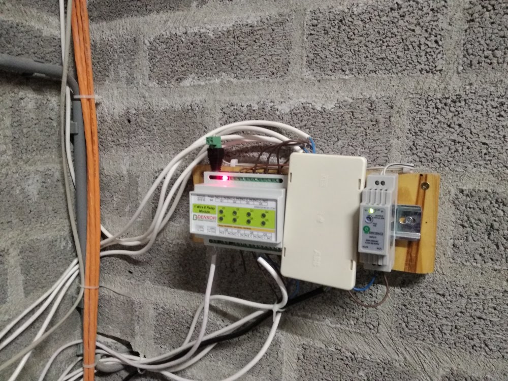
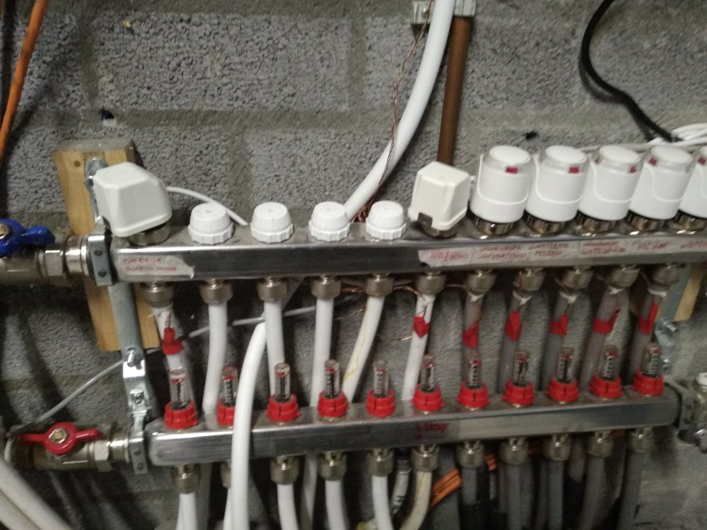
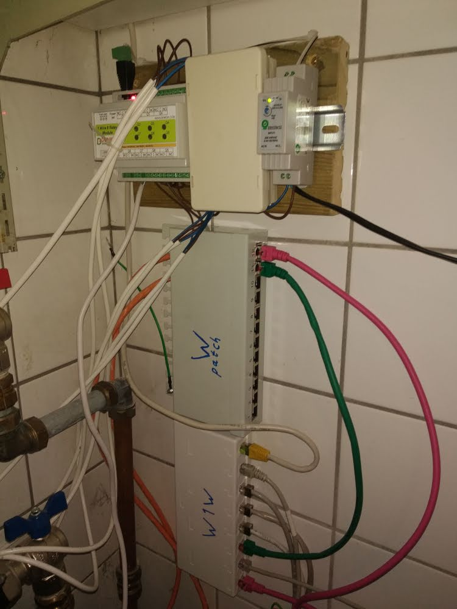
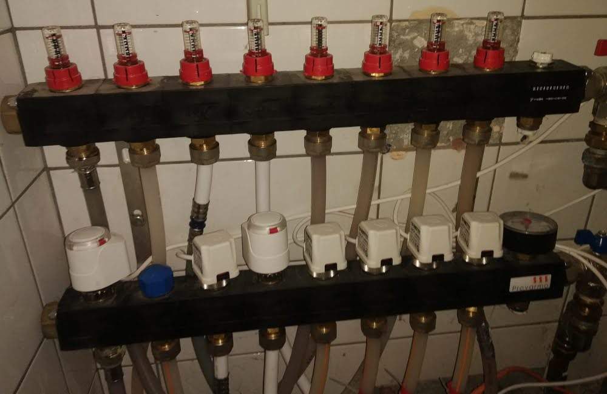
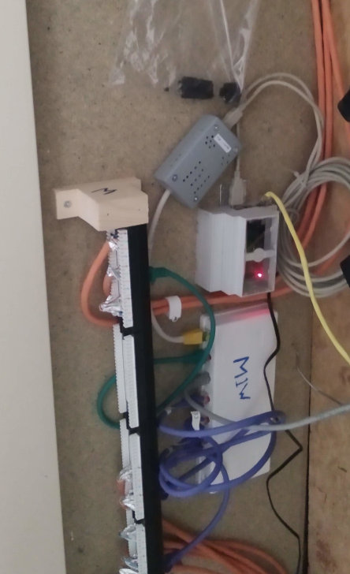
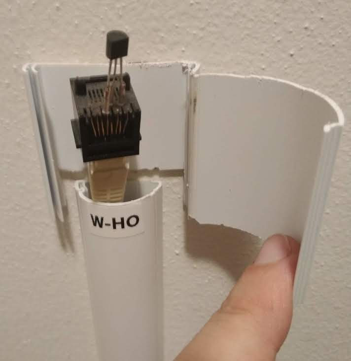
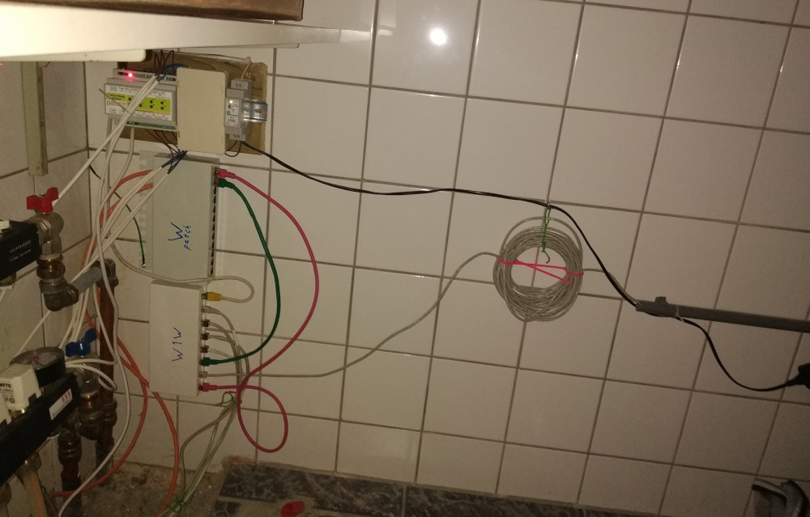
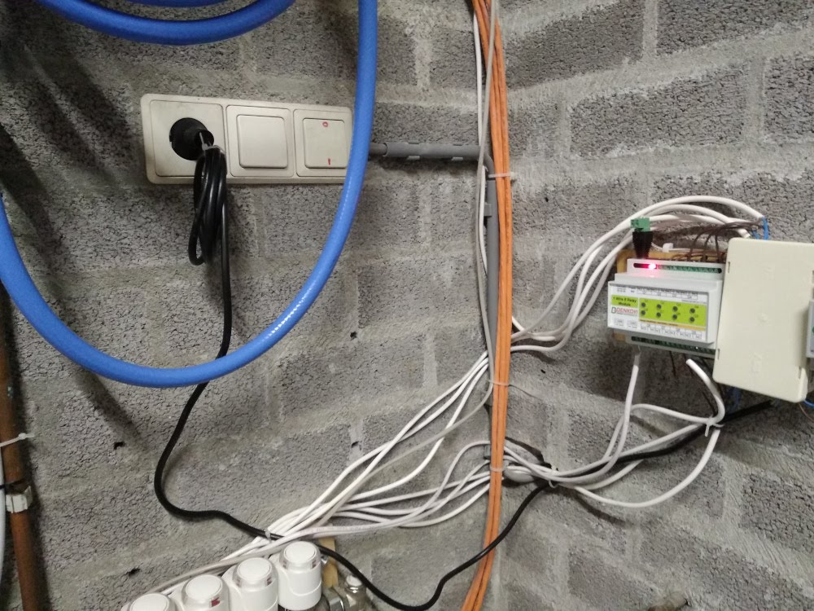

# Inschakelen

## Controle verwarmings-afgiftecircuit vooraf aan inschakelen afgiftesysteem

Stappenplan:
- Controleer of het verwarmings-afgiftecircuit op druk is (de rechter meter, moet boven de 1,5 bar staan).
   - 
   - Als de druk niet voldoende is, dan moet het afgiftecircuit bijgevuld worden voordat het afgiftesysteem ingeschakeld mag worden.
   - De linker meter is van het bron-circuit, deze is geen onderdeel van het afgiftecircuit (maar wel belangrijk voor de warmtepomp zelf).
- Controleer of het buffervat op de gewenste temperatuur is.
   - 
   - 
   - In de winter moet het buffervat een temperatuur boven de 20 graden hebben.
   - In de zomer moet het bufervat een temperatuur onder de 20 graden hebben.
   - Indien de temperaturen niet goed zijn, check dan de werking van de warmtepomp voordat het afgiftesysteem ingeschakeld mag worden.
- Is de circulatie-pomp in goede conditie?
   - 
   - Indien de circulatiepomp beschadigd is, dan deze repareren voordat het afgiftesysteem ingeschakeld mag worden.

## Standaardprocedure voor inschakelen

### Gebruik
Dit is de procedure om het verwarmings-afgifte-systeem in normale bedrijfsmode in te schakelen.

### Stappen
Stappenplan:
- Voer bovenstaande controle vooraf aan inschakelen circulatie uit.
- Controleer of alle elektrische verbindingen in de garage veilig zijn.
   - Controleer de besturings-electronica
     - 
   - Controleer de actuatoren op de verdeler
     - 
- Controleer of alle elektrische verbindingen in de waskamer veilig zijn.
   - Controleer de besturings-electronica
     - 
   - Controleer de actuatoren op de verdeler
     - 
- Controleer of alle elektrische verbindingen in de meterkast veilig zijn.
   - 
- Controleer of alle sensoren correct en veilig aangesloten zijn.
   - 

- Steek (in de waskamer) de stekker van de waskamer-controller in het stopcontact.
   - 
- Steek (in de garage) de stekker van de garage-controller in het stopcontact.
   - 
- Steek (in de garage) de stekker van de circulatie-pomp in het schakel-stopcontact (rechts van de circulatie-pomp).
   - 
- Steek (in de meterkast) de stekker van de centrale controller in het stopcontact.
   - 

## Noodprocedure vorstbeveiling circulatie starten.

### Achtergrond Informatie
Als het domotica-besturingssysteem geen stroom heeft, dan gaan de verwarmingskleppen automatisch naar de volgende standaard-posities:
- NO/Open/actief: huiskamer, werkkamer, badkamer
- NC/Dicht/inactief: hal, overloop en alle slaapkamers boven

Door de stroom van het domotica-besturingssysteem af te halen en de circulatiepomp langs het domotica systeem heen in te schakelen zullen alle vertrekken die automatisch naar NO/open/actief gaan verwarmd worden en alle vertrekken die automatisch naar NC/dicht/inactief gaan niet verwarmd worden.

### Gebruik
Deze procedure dient alleen gebruikt te worden bij een ernstige storing in het afgifte-systeem in de winter als vorstbeveiliging en kan (vanwege continue draaien van de circulatiepomp) slechts tijdelijk gebruikt worden.

De NO/NC configuratie is ingericht voor verwarming/vorstbeveiliging, deze configuratie is niet ingericht om automatische koeling te starten.

### Stappen
Stappenplan:
- Zorg ervoor dat (in de garage) de stekker van de centrale controller uit het stopcontact is.
   - 
- Zorg ervoor dat (in de wasruimte) de stekker van de bovenverdieping controller uit het stopcontact is.
   - 
- Zorg ervoor dat (in de meterkast) de stekker van de centrale controller uit het stopcontact is.
   - 
- Zorg dat het systeem minimaal 10 minuten uit staat (dit is nodig om de kleppen naar hun standaard-posities te laten gaan).
- Voer de controle vooraf aan inschakelen (druk op het systeem, conditie pomp) uit.
- Zorg ervoor dat (in de garage) de stekker van de circulatiepomp in het actieve stopcontact naast de deur naar de bijkeuken/keuken zit.
