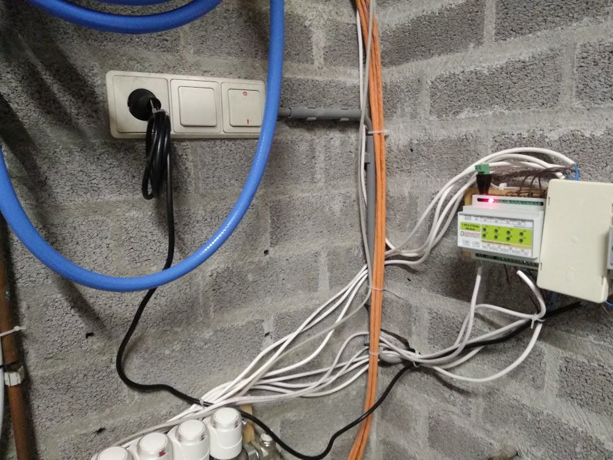
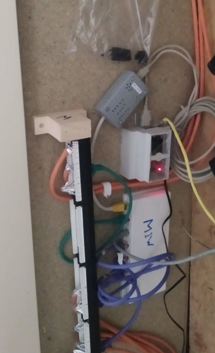
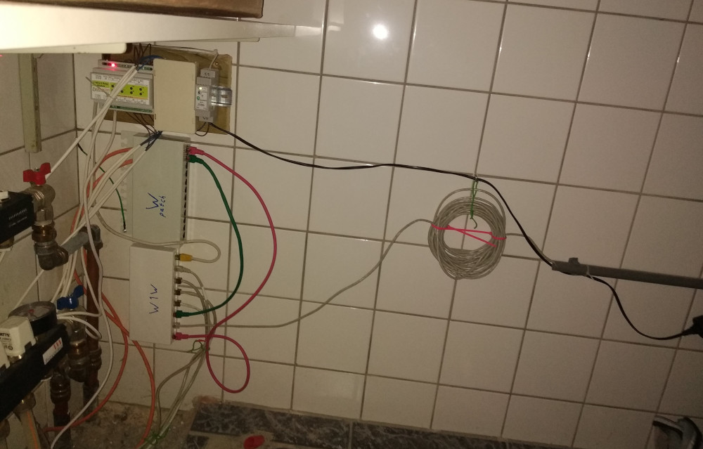

# Uitschakelen

## Gebruik
Dit is de procedure om het verwarmings-afgifte-systeem uit te schakelen.
Uitschakelen van het systeem is noodzakelijk als het systeem beschadigd is, als de waterdruk te laag is of vooraf bij onderhoud aan het verwarmingssysteem.

De besturings computer/laptop/tablet/telefoon is niet direct gekoppeld aan het systeem (maar maakt verbinding over WiFi). Deze kan los van de rest van het systeem aan en uitgezet worden.

## Stappen
Stappenplan:
- Indien mogelijk: Schakel het systeem over op vorstbeveiliging.
- Trek (in de garage) de stekker van de circulatie-pomp uit het stopcontact.
   - 
- Trek (in de garage) de stekker van de garage-controller uit het stopcontact.
   - 
- Trek (in de meterkast) de stekker van de centrale controller uit het stopcontact.
   - 
- Trek (in de waskamer) de stekker van de waskamer-controller uit het stopcontact.
   - 
