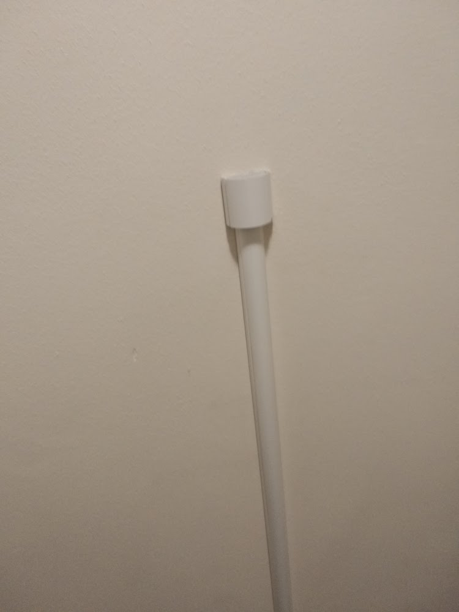
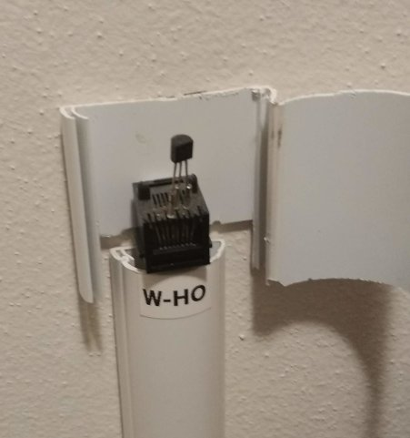
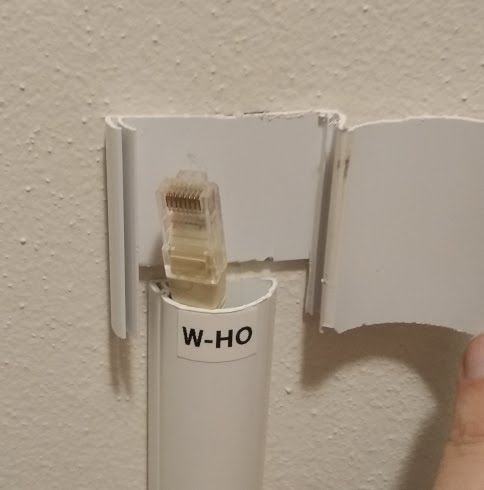
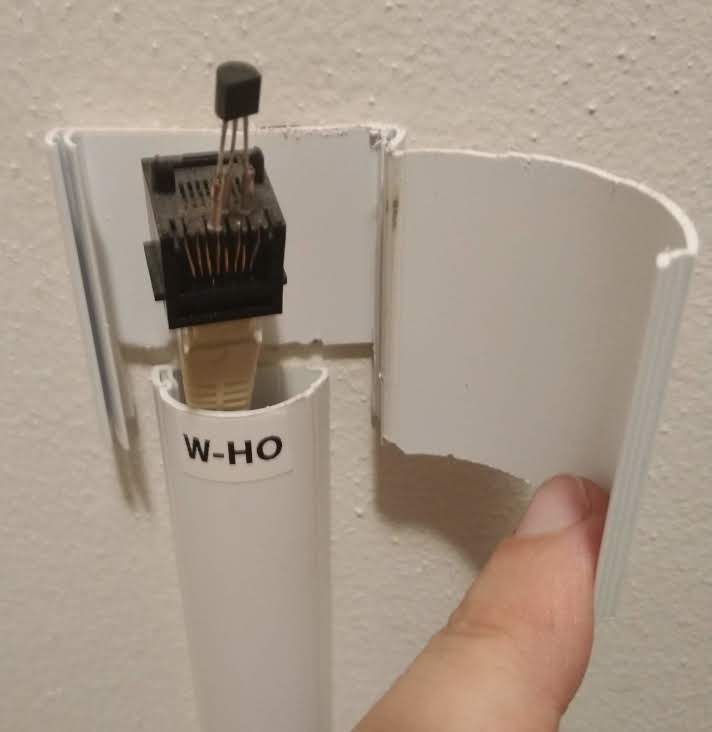

# Verwisselen defecte sensor

## Algemeen

Alle sensoren in House G zijn aangesloten via een UTP stekker. De meeste sensoren zitten op 1,2 meter hoogte. Sensoren beneden met een 1,2 meter lange UTP stekker naar de UTP-socket, sensoren boven direkt op de UTP stekker op 1,2 meter hoogte.

Het verwisselen van een sensor bestaat uit 2 delen:
- Fysiek vervangen van de sensor.
- Het vervangen van de sensor in de software-configuratie.

## Stappen

Stappenplan:
- Controleer dat het systeem werkt (door website (TODO link) te openen)
- Zoek een vervangende sensor op.
  - TODO: Plaatje
- Zoek de (kabelgoot)cover op die bij de sensor hoort.
  - 
- Maak de (kabelgoot)cover die bij de sensor hoort open.
  - 
- Klik de oude sensor los bij de UTP aansluiting.
  - 
- Klik de nieuwe sensor in de UTP aansluiting.
  - 
- Lees het identificatie-nummer van de sensor van het label en schrijf het nummer op.
- Open deze website (TODO: link) om de sensor te koppelen.
  - Indien deze website niet werkt en het domotica-systeem op dit punt uitgevallen, dan is de nieuwe sensor beschadigd.
     - Klik in dat geval de nieuwe sensor los (en laat de sensor repareren of gooi de sensor weg) en herstart het stappenplan met een andere nieuwe sensor.
- Sluit de kabelgoot weer door hem dicht te drukken.
  - 
- Laat de defecte sensor repareren of gooi hem weg.
