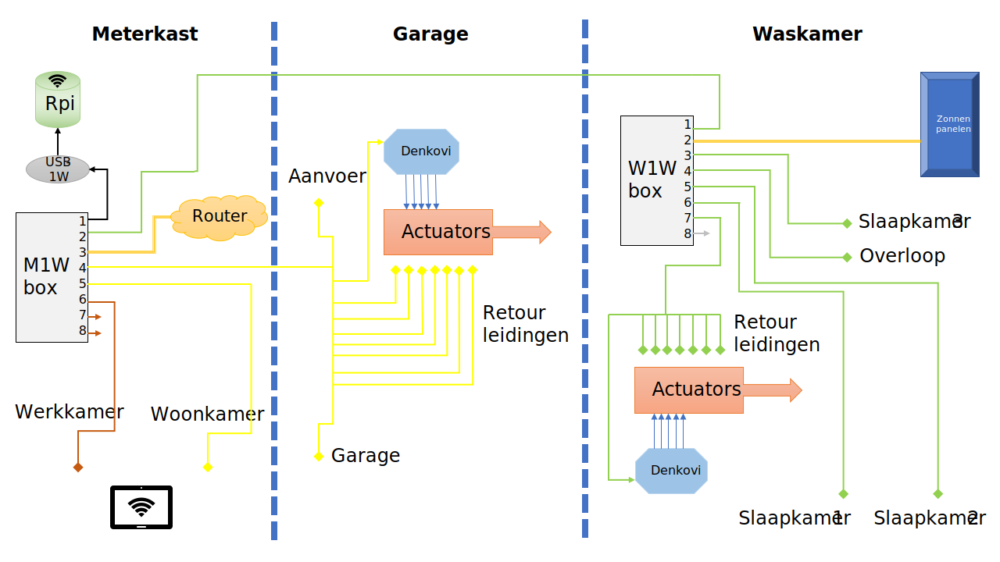
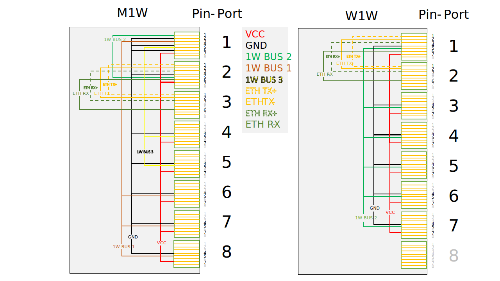

# House G - Systeembeschrijving

## Computer en domotica UTP netwerk bedrading

Huis G is voorzien van een UTP-netwerk met 3 standaard UTP patch panelen en 2 routing-panelen specifiek t.b.v. het domotica en computer netwerk.

| Code | Naam                  | Locatie |
| ---  | ---                   | ---     |
| G    | Garage Patchpaneel    | In schuur/garage bij verwarmings-verdeler |
| M    | Meterkast Patchpaneel | Begane grond in meterkast bij entree/hal  |
| M1W  | Meterkast Routing     | Vlakbij patchpaneel M                     |
| W    | Waskamer Patchpaneel  | Eerste verdieping, onder trap naar zolder |
| W1W  | Waskamer Routing      | Vlakbij patchpaneel W                     |

Elke ruimte is via UTP aangesloten op 1 van de patch-panelen en patchpanelen G en W zijn beiden verbonden met paneel M.

## Domotica netwerk.

Het besturings-netwerk van het domotica-systeem gebruikt [1-wire](https://en.wikipedia.org/wiki/1-Wire) over UTP.

### Netwerk layout

### Aansluitschema

### Gebruikte componenten

Gebruikte componenten in het systeem:

| Aantal | Functie                    | Component/Apparaat |
| ---    |  ---                       |  ---               | 
|      1 | Centrale Computer          | [Raspberry PI 3](https://www.raspberrypi.org/) |
|      1 | 1-wire host interface      | [USB-to-1wire Convertor](http://denkovi.com/usb-to-one-wire-interface-adaptor-converter-thermometer) |
|      2 | Pomp/Actuator aansturing   | [8 Kanaals Relay Module 1-wire](http://denkovi.com/1-wire-eight-channel-relay-module-for-home-automation-with-din-box) |
|    ~10 | Kamer temperatuur meten    | DS18B20 1-wire temperature sensor |
|    ~10 | Leiding temperatuur meten  | DS18B20 1-wire temperature sensor |
